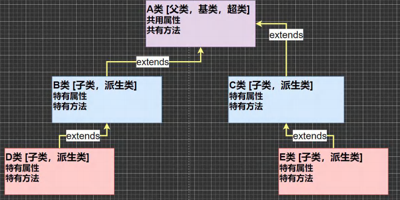
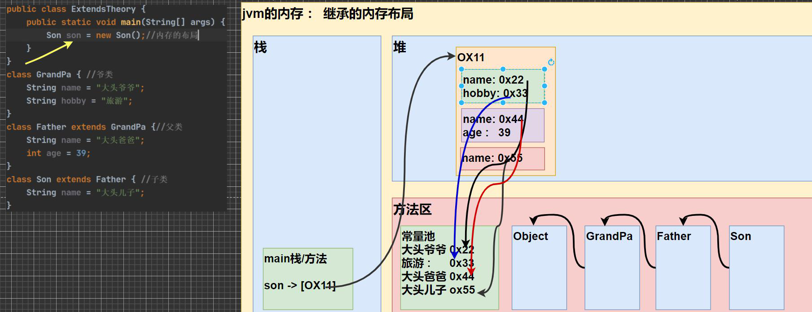

# 该项目主要用于 巩固 Java SE 基础相关知识

### [二进制，八进制，十进制，十六进制，位运算](https://github.com/luowentao724/JavaSE/tree/master/src/com/java/core/base/BinaryTest.java)

## 🌕 Java 编程基础（45 天）
### 知识

- 环境搭建 (TODO windows 和 mac 两种文档 耗时 2 小时)
- IDEA 开发工具 (TODO 输出四篇文档 耗时工作 8 小时)
    - 新建项目 
    - 运行调试
    - 界面配置
    - 插件管理
- **Java 基础语法**
    - 数据类型  (文档一篇 4 小时)
    - 流程控制  (文档一篇 8 小时)
- 数组
- **面向对象** (文档一篇 8 小时)
    - 方法
    - 重载 
    - 封装
    - 继承
    - 多态
- 抽象类 (文档一篇 4 小时)
- 接口 (文档一篇 4 小时)
- 枚举 (文档一篇 4 小时)
- 常用类 (文档两篇 8 小时)
    - String 
    - 日期时间
- 集合类 (文档一篇 16 小时)
- 泛型 (文档一篇 16 小时)
- 注解 (文档一篇 16 小时)
- 异常处理 (文档一篇 16 小时)
- 多线程 (文档一篇 16 小时)
- IO 流 (文档一篇 16 小时)
- 反射 (文档一篇 16 小时)

## 面向对象

#### 什么是方法？ 
 * 用面向对象的思想表达就是：某一类对象 存在的行为 叫做方法
 * 例如：人除了有年龄，名称等这些属性还有吃，跑步，学习，做题等这些行为
 * 方法的作用：提高代码的复用性，体现面向对象三大特性 的 封装
##### 方法的定义
   * 成员方法：访问修饰符  返回值类型  方法名 （参数列表 ...）
     ```
      // 这是一个 无返回值的 公开方法，需要传入一个 String 类型参数
      public void testMethod(String str) {
        // 方法体
      }
     
     // 这是一个 有返回值的 私有方法，需要传入一个 String 类型参数
      private String testMethod(String str) {
        // 方法体
        return "我是返回值"；
      }
     ```
    
     * 访问修饰符：public ，protected, 默认, private]
     * 返回值类型：可以是基本类型和引用类型 ，void 表示没有返回值，如果方法要求有返回值则必须返回，否则会报错
     * 方法名：遵循驼峰命名法，最好见名知义，表达出该功能的意思即可, 比如 得到两个数的和 getSum, 开发中按照规范
     * 参数列表：表示成员方法输入 cal(int n) ， getSum(int num1, int num2)

#### 什么是重载（OverLoad）？
  重载主要体现在方法上。
  在同一个类重有两个方法它们的方法名相同，参数类型不一致 就是重载。
  ```
  public class OverLoadClass {
  
    public void testOverLoad(String str ,int num){
    
    }
    
    public void testOverLoad(String str ,String str2){
    
    }
  }
  
  ```
##### 重载的好处？
  * 减轻了起名的麻烦
  * 减轻了记名的麻烦

##### 可变参数
基本概念：java 允许将同一个类中多个同名同功能但参数个数不同的方法，封装成一个方法。 
        就可以通过可变参数实现
```
  public void changeParam(int ...nums){
    for(int i=0;i<nums.length;i++){
      System.out.println(nums[i]);
    }
  }
  // 调用时 changeParam(0)  changeParam(2,4,6) 这样都可以
```
* 可变参数的实参可以是多个和任意多个
* 可变参数的实惨可以为数组
* 可变参数的本质就是数组
* 可变参数可以和普通类型参数放在一起，但可变参数必须放在最后
* 一个形参列表中只能有一个可变参数

##### 什么是变量作用域？
    总结 ：变量在 Java程序的生效范围。
* Java 编程中，主要的变量就是 属性（成员变量）和局部变量
* 局部变量一般是指在成员方法中定义的变量。
* Java中作用域的分类
  * 全局变量也就是属性，作用于整个类体 ，例如 Cat ，eat 等方法使用属性
  * 局部变量：也就是除属性之外的其他变量，作用域为定义它的代码块中。
* 全局变量可以不赋值直接使用，因为有默认值 ，局部变量必须赋值后才能使用，因为没有默认值

```
public class VarScope {
     
     // 全局变量 可以赋值
    private String num = 10;
    
    //也可以不赋值 ，默认为 false
    Boolean flag;
    
    // 这里的 num 也属于局部变量
    public void test(Integer num){
        String sc = "局部变量";
    }
}
```
 
##### 构造方法 / 构造器
总结：创建类实例的时候默认执行的方法，完成对新对象的初始化，可以用于给成员变量赋值。方法名必须和类名相同。可以重载。
* 构造器的修饰符可以默认，也可以是public protected private
* 构造器没有返回值
* 方法名和类名字 必须一样
* 参数列表 和 成员方法一样的规则
* 构造器的调用，由系统完成
* 如果没有为类定义构造器，则编译器会自动给该类生成一个默认的无参构造器，定义了，则不会有默认构造器

```
public class Person{
    
    String name;
    
    int age;
    // 这就是构造方法 ， this 关键字 用于指定当前对象的属性
    Person(String name,int age){
        this.name = name;
        this.age = age;
    }
    
}
```

##### 什么是访问修饰符，都有什么作用？
Java 中提供四种访问控制修饰符号，用于控制方法和属性（范围）：
* 公开级别：public 修饰，对外公开
* 受保护级别：用 protected 修饰，对子类和同一个包中的类公开
* 默认级别：没有修饰符号，向同一个包中的类公开
* 私有级别：用private 修饰，只有类本身可以访问，不对外公开。

|访问级别 | 访问控制修饰符 | 同类 | 同包 | 子类 | 不同包 |
| :-----| ----: | :----: |:----: |:----: |:----: |
| 公开 | public | ✅ | ✅ | ✅ | ✅ |
| 受保护 | protected | ✅ | ✅ | ✅ | ❌ |
| 默认 | default | ✅ | ✅ | ❌ | ❌ |
| 私有级别 | private | ✅ | ❌ | ❌ | ❌ |

* 修饰符可以用用来修饰类中的属性，成员方法以及类
* 只有默认的和public 才能修饰类，并且遵循上述访问权限的特点
* 成员方法的访问规则和属性一样

#### 封装
总结：封装就是把抽象出的数据[属性]和对数据的操作[方法]封装在一起，数据被保护在内部，程序的其他部分只有通过被授权的操作[方法]，才能对数据惊进行操作。

##### 封装的步骤
* 将属性私有化 private
* 提供一个公共方法（public） set方法，用于对属性判断与赋值
* 提供一个公共的 get 方法，用于获取该属性的值

#### 继承
总结：继承就是将一些类的公共属性，方法提取出来，作为父类，不同的地方由各个子类去实现。extents 关键字   
例如：人属于一个类，它有公共的属性 身高，体重，年龄等，学生也是一个类，但学生是属于人的一种，
它除了有刚才人的属性外还有其他 班级，学校等属性，
此时咱们就可以用 学生类 去继承 人类，学生类就自动拥有人这个父类的所有属性和方法类。

作用：继承可以解决代码复用,让我们的编程更加靠近人类思维.当多个类存在相同的属性(变量)和方法时,可以从这些类中 抽象出父类,在父类中定义这些相同的属性和方法，
所有的子类不需要重新定义这些属性和方法，只需要通过 extends 来 声明继承父类即可。画出继承的示意图



```
// 继承的基本语法
class 子类 extents 父类 {
    // 子类会自动拥有父类定义的属性和方法
    // 父类又叫超类，基类
    // 子类又叫派生类
}
```
##### 继承的细节总结
1) 子类继承了所有的属性和方法，非私有的属性和方法可以在子类直接访问, 但是私有属性和方法不能在子类直接访 问，要通过父类提供公共的方法去访问 
2) 子类必须调用父类的构造器， 完成父类的初始化 
3) 当创建子类对象时，不管使用子类的哪个构造器，默认情况下总会去调用父类的无参构造器，如果父类没有提供无 参构造器，则必须在子类的构造器中用 super 去指定使用父类的哪个构造器完成对父类的初始化工作，否则，编译 不会通过
4) 如果希望指定去调用父类的某个构造器，则显式的调用一下 : super(参数列表) 
5) super 在使用时，必须放在构造器第一行(super 只能在构造器中使用) 
6) super() 和 this() 都只能放在构造器第一行，因此这两个方法不能共存在一个构造器 
7) java 所有类都是 Object 类的子类, Object 是所有类的基类. 
8) 父类构造器的调用不限于直接父类！将一直往上追溯直到 Object 类(顶级父类) 
9) 子类最多只能继承一个父类(指直接继承)，即 java 中是单继承机制。 思考：如何让 A 类继承 B 类和 C 类？ 【A 继承 B， B 继承 C】 
10) 不能滥用继承，子类和父类之间必须满足 is-a 的逻辑关系

##### 继承的本质分析
用一个案例来分析当子类继承父类，创建子类对象时，内存中到底发生了什么？（建立查找关系）

```
package com.java.core.inherit;

/**
 * @author Mr.luo
 * @version 1.0
 * @description: 继承的本质分析
 * @date 2021/12/11 8:47 下午
 */
public class ExtendsTheory {
    public static void main(String[] args) {
        Son son = new Son();
        //内存的布局
        // ?-> 这时请大家注意，要按照查找关系来返回信息
        // (1) 首先看子类是否有该属性
        // (2) 如果子类有这个属性，并且可以访问，则返回信息
        // (3) 如果子类没有这个属性，就看父类有没有这个属性(如果父类有该属性，并且可以访问，就返回信息..)
        // (4) 如果父类没有就按照(3)的规则，继续找上级父类，直到 Object...
        // 返回就是大头儿子
        System.out.println(son.name);
        // 返回的就是 39
        System.out.println(son.getAge());
        // 返回的就是旅游
        System.out.println(son.hobby);
    }
}

/**
 * @author Mr.luo
 * @version 1.0
 * @description: 爷类
 * @date 2021/12/11 9:12 下午
 */
class GrandPa {
    String name = "大头爷爷";
    String hobby = "旅游";
}

/**
 * @author Mr.luo
 * @version 1.0
 * @description: 父类
 * @date 2021/12/11 9:14 下午
 */
class Father extends GrandPa {
    String name = "大头爸爸";
    private int age = 39;

    public int getAge() {
        return age;
    }
}

/**
 * @author Mr.luo
 * @version 1.0
 * @description: 子类
 * @date 2021/12/11 9:15 下午
 */
class Son extends Father {
    String name = "大头儿子";
}
```
上段代码 Son son = new Son()的内存分析图：



##### super 关键字
总结：super关键字代表父类的引用 ，用于访问父类的属性，方法，构造器。  
访问父类的属性不能访问 private 修饰的。
访问父类的方法不能访问 private 修饰的。
访问父类的构造器，有且只能写在子类构造器的第一行。  
> this 关键字 和 super 关键字的区别：

|No | 区别点 | this | super |
| :-----| :-----: | :----: |:----: |
| 1 | 访问属性 | 访问本类的属性，如果本类没有则会从父类查找 | 从父类开始查找属性 |
| 2 | 调用方法 | 访问本类的方法，如果本类没有方法会从父类中查找 | 从父类开始查找方法 |
| 3 | 调用构造器 | 调用本类构造器必须放在构造器首行 | 调用父类构造器必须放在子类构造器第一行|
| 4 | 特殊 | 表示当前对象 | 子类访问父类对象 |

##### 方法的重写[override]
简单的说∶方法覆盖（重写）就是子类有一个方法，和父类的某个方法的名称、返回类型、参数一样，
那么我们就说子类的这个方法覆盖了父类的方法  

注意事项和使用细节  
* 子类方法的形参列表 和 方法名称 要和父类方法的 形参列表和方法名称一致 
* 子类方法的返回类型 必须和父类方法的返回类型一致 ，或者是父类返回类型的子类
* 子类方法不能缩小父类方法的返回权限 public -> protected -> default -> private
```
// 父类方法
public Object overrideTest(){
}

// 子类重写类父类的overrideTest 
public String overrideTest(){
}

```
##### 重写和重载的区别
| 名称| 发生范围| 方法名| 形参列表| 返回值类型| 修饰符|   
| :-----| :-----: | :----: |:----: |:----: |:----: |
|重载 | 同一个类| 必须一致 | 必须不一致| 无要求 | 无要求|   
|重写 | 父子类| 必须一致 | 必须一致| 必须和父类方法的返回类型一致 ，或者是父类返回类型的子类| 子类方法的访问权限大于等于父类方法|   

#### 什么是多态？
方法或对象具有多种形态。是面向对象的第三大特征，多态是建立在封装和继承基础之上的。  
多态的具体体现：
1. 方法的多态，主要体现在重载 和 重写
2. 对象的多态
   1. 一个对象的编译类型和运行类型可以不一致
   2. 编译类型在定义对象时就确定了，不能改变
   3. 运行类型是可以变化的
   4. 编译类型看定义是 = 号的左边，运行类型看 = 的右边

##### 多态的注意事项与细节讨论
多态的前提：两个对象（类）必须存在继承关系   

多态的向上转型
* 本质：父类引用指向子类对象
* 语法：父类 引用名 = new 子类()
* 特点：编译类型看左边，运行类型看右边。可以调用父类中所有成员(需遵循访问权限)，不能调用子类特有成员，最终运行效果看子类的实现。

多态的向下转型
* 语法：子类 子类引用 = (子类)父类引用;
* 只能强转父类引用，不能强转父类对象
* 当前父类对象的引用，必须指向当前目标类型的对象。
* 当向下转型时，可以调用子类中所有成员。

Java 动态绑定机制
* 调用对象方法时，该对象会自动绑定该对象运行时对象的**内存地址/运行类型**绑定
* 当调用对象属性时，没有动态绑定机制，在那里调就在那里用

### 🌖 Java 8（3 天）
#### 知识
- Stream API
- Lambda 表达式
- 新日期时间 API
- 接口默认方法


